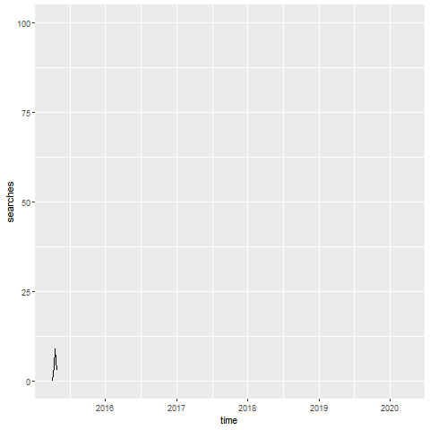
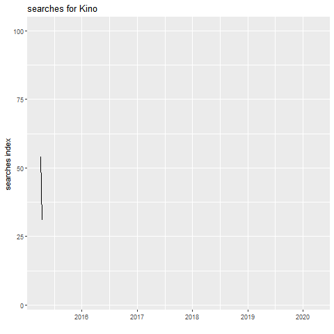
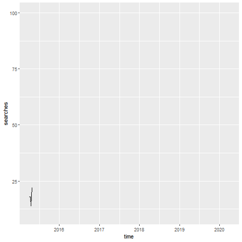
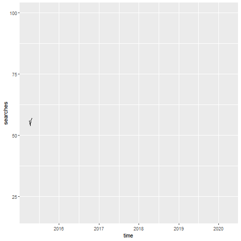

```{r setup, include=FALSE}
library(flexdashboard)
library(openxlsx)
library(tidyverse)
library(data.table)
library(zoo)
library(dygraphs)
library(xts)
library(gganimate)

# online tutorial for analyzing google trends in R:
# https://www.datacareer.ch/blog/analyzing-google-trends-with-r-retrieve-and-plot-with-gtrendsr/

# kons_SA_nom_q <- data.table(read.xlsx(file.path("kons_SA_csa_new.xlsx"),
#                      sheet = "real_q",
#                      startRow = 11))%>%
#   rename(year = V1, q = V2) %>%
#   select(., -starts_with("V")) %>%
#   pivot_longer(c(-year,-q), names_to = "ts") %>%
#   filter(!is.na(value)) %>%
#   pivot_wider(c(year,q), names_from = ts, values_from = value) %>%
#   mutate(date=as.Date(as.yearqtr(paste0(year, sep="-",q)))) %>%
#   data.frame() %>%
#   `row.names<-`(.,.$date) %>%
#   select(-date,-year,-q) %>%
#   as.xts()

kons <- dataseries::ds("ch_seco_gdp.sa.real.han", "xts")


```
Project idea {.storyboard}
=====================================
### <font size="3.8"><span style="color:#080A47">We use Google Trends to provide a complementary tool: Fast, cheap, and agile tracking of consumer confidence</span></font>  {data-commentary-width=1000}

- <font size="6">Consumer confidence is established as a key driver of economic activity.</font>
- <font size="6">Like in other countries, there is an index available for Switzerland.</font>
- <font size="6">However, this is expensive (surveys) and only available quarterly.</font>

***

{width=400px} {width=400px}

{width=400px}  {width=400px}


### <font size="3.8"><span style="color:#080A47">Project Contribution and Target Groups</span></font>  {data-commentary-width=400}

```{r}
```

***

Our contribution in detail:

- Open-source R code to extract data from Google Trends.


- Free and flexible illustration of data.


Target groups:

- State Secretariat for Economic Affairs (SECO)


- Businesses

### <font size="3.8"><span style="color:#080A47">Consumer Confidence - Idea and Definition</span></font>  {data-commentary-width=400}

```{r}
```

***

Generally, consumer confidence is high when the unemployment rate is low and GDP growth is high. Measures of average consumer confidence can be useful indicators of how much consumers are likely to spend.

There is no unified definition of consumer confidence.

Instead, there are various indicators built to measure consumer confidence. Their definitions vary.


We have a positive list and a negative list --- what people search for during good and bad times:

Positive items include:


Negative items include: RAV, Rezession, Insolvenz

Existing indicators {.storyboard}
=====================================

Consumer expenditure
=====================================
Column {data-width=200}
-------------------------------------

Column {data-width=800}
-------------------------------------
### Consumer expenditure
```{r}
dygraph(kons, main = "Consumer expenditure")%>%
  dyHighlight(highlightSeriesOpts = list(strokeWidth = 3)) %>%
  dyAxis("x", drawGrid = FALSE)%>%
  dyLegend(show = "follow") %>%
  dyRangeSelector()
```
